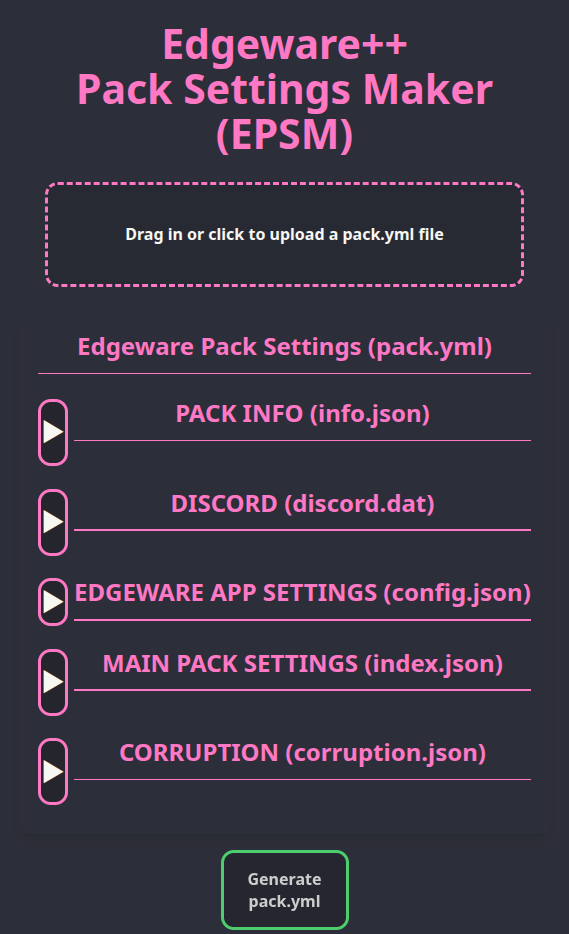

# Edgeware++ Pack Settings Maker (EPSM)

## What is this?

**Edgeware++ Pack Settings Maker (EPSM)** is a companion tool for [Edgeware++](https://github.com/araten10/EdgewarePlusPlus). **EPSM** helps create the settings for your custom **Edgeware++** pack by using a graphical web interface.

## How does it work?

1. You use **EPSM** to generate a `pack.yml` settings file.
2. You use **Edgeware++**'s built-in [**Pack Tool**](https://github.com/araten10/EdgewarePlusPlus/tree/main/pack_tool) to compile your media files and `pack.yml` into a pack that can be imported into **Edgeware++**. 

## How to Use

### Prerequisites

- Make sure that you have [installed **Edgeware++** onto your Windows/Linux computer](https://github.com/araten10/EdgewarePlusPlus/releases). This comes with the **Edgeware++** program and the **Pack Tool**.

### Quickstart (for experienced Pack Makers)

If you already know how to make Edgeware++ packs (or you prefer to learn by experimenting), you can follow this guide to get started quickly:

1. Use Edgeware++'s built-in **Pack Tool**. Instructions can be found in the [README for the Pack Tool](https://github.com/araten10/EdgewarePlusPlus/tree/main/pack_tool) to create a new working folder for your pack
2. Open [**EPSM**]() and use it to generate a `pack.yml`
3. Replace your pack's default `pack.yml` with the one you generated with **EPSM**
4. Put all your media files into the relevant folders within your pack's working folder
5. Use the **Pack Tool** to compile your working folder into an **Edgeware++ Pack**

### Detailed Guide (for new Pack Makers)

If you're new to making Edgeware packs, the following tutorial series will show you how to make your own **Edgeware++** pack using **EPSM** and the **Pack Tool**:
- [Lesson 0: Anatomy of an Edgeware++ pack](/docs/lessons/00.md)
- [Lesson 1: Your first pack](/docs/lessons/01.md)
- [Lesson 2: Changing how your pack behaves](/docs/lessons/02.md)
- [Lesson 3: Moods and curating content](/docs/lessons/03.md)
- [Lesson 4: Dynamically changing Pack Settings with Corruption](/docs/lessons/04.md)
- [Lesson 5: Climax and Ending Notes](/docs/lessons/05.md)
