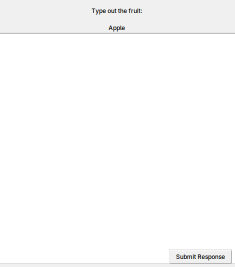
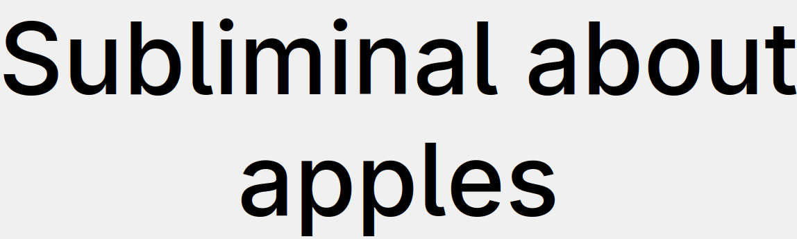

# Lesson 0: Anatomy of an Edgeware++ pack

## What is an Edgeware pack?

A collection of media files (images, videos, audio) and text content (captions, notifications.etc) that Edgeware++ uses for a session. A pack also has configuration files (in JSON format) that define all the content and settings that a pack uses. 

## What is a Popup?

When Edgeware++ takes the content in a pack and makes it "pop up" on the user's computer, it's called a *Popup*. The following Popup types exist in Edgeware++:

### Image Popups

*Image Popups* display an image file from the pack as its own application window. *Image popups* can also contain captions and overlays for censorship and/or hypno. *Image Popups* can be removed by clicking on them (they can also be set to expire on their own).


### Video Popups

*Video Popups* behave just like Image Popups, but play a video file on loop instead.

### Audio Popups

*Audio Popups* play an audio file in the background. *Audio Popups* cannot be removed except by quitting the Edgeware++ session. When the audio file finishes playing, the *Audio Popup* disappears too.

### Prompt Popups

*Prompt Popups* open a window that forces the user to type out a preset message to make the Popup disappear. 



### Subliminal Popups

*Subliminal Popups* are text messages that flash across the screen for a short period of time.



### Notification Popups

*Notification Popups* open desktop notifications on the user's computer with a custom message.

### Web Popups

A *Web Popup* opens a link in the user's default web browser. *Web Popups* can only open links that are explicitly set in a pack's settings.

## Configuration Files

Edgeware++ packs use a number of configuration files to control how a pack behaves. Using a `pack.yml` makes it easy to automatically generate all these configuration files using a single file. See [What is pack.yml?](#what-is-packyml) below for more. 

Using **EPSM** will help you automatically generate these configuration files instead of having to manually type them out.

These are the configuration files used by Edgeware++:

### info.json

`info.json` contains information about a pack and its creator.
```
{
  "name": "Pack Name Here (~20 char max)",
  "id": "idThatWillMakeMoodFile",
  "creator": "Your Name Here (~20 char max)",
  "version": "1",
  "description": "Enter a description here. (~400 char max)"
}
```

### discord.dat

`discord.dat` contains text to display as the user's Discord status while they are running the pack with Edgeware++.
```
Discord status message here
```

### config.json

`config.json` contains all the settings that control how Edgeware++ behaves. These settings can change how Popups behave and even run Edgeware++ in special modes like Corruption Mode.
```
{
"delay": 1000,  
"popupMod": 100,
"audioMod": 20,
"movingChance": 5, 
"movingSpeed": 2, 
"movingRandom": 1,
"promptMod": 0, 
...
...
}
```

### index.json

`index.json` contains all the filenames for the media files and text used by all the different kinds of Popups. The data is grouped into categories called Moods.
```
{
  "default": {
    "maxClicks": 1,
    "captions": [
      "Neutral Caption"
    ],
    "popupClose": "Close Popup",
    ...
    ...
  },
  "moods": [
    {
      "mood": "happy",
      "maxClicks": 1,
      "captions": [
        "Happy caption 1",
        "Happy caption 2"
      ],
      "media": [
        "happy1.jpg",
        "happy2.jpg"
      ]
    },
    {
      "mood": "sad",
      ...
      ...
    },
    {
      "mood": "default",
      "media": [
        "neutral.jpg"
      ]
    }
  ]
}
```

### corruption.json

`corruption.json` contains settings for Edgeware++'s Corruption Mode. In Corruption Mode, a pack has multiple Corruption Levels. Each Corruption Level has its own settings, which makes it possible to make a pack behave differently for each level. See [Corruption tutorial](../lessons/04.md) to learn more.
```
{
  "moods": {
    "1": {
      "remove": [],
      "add": [
        "happy"
      ]
    },
    "2": {
      "remove": [
        "happy"
      ],
      "add": [
        "sad"
      ]
    }
  },
  "wallpapers": {
    "1": "happy.png",
    "2": "sad.png"
  },
  "config": {
    "1": {
      "delay": 9000,
      "popupMod": 100
    },
    "2": {
      "delay": 3000,
    }
  }
}
```

### What is `pack.yml`?

`pack.yml` is an all-in-one YAML file that the Edgeware++ Pack Tool uses to generate all the configuration files that Edgeware++ uses (`info.json`, `discord.dat`, `config.json`, `index.json` and `corruption.json`). 

`pack.yml` makes pack creation simpler by bundling all the settings a pack uses into one file. **EPSM** makes it even easier to generate `pack.yml` by providing a graphical user interface for creating the file.

In the example below, you'll notice that the file contents combine the contents of the `info.json`, `discord.dat`, `config.json`, `index.json` and `corruption.json` examples that came before:
```
info:
  generate: true
  name: Pack Name Here (~20 char max)
  id: idThatWillMakeMoodFile
  ...
  ...
discord:
  generate: true
  status: Discord status message here
config:
  generate: true
  raw:
    delay: 5000
    popupMod: 100
    audioMod: 20
    ...
    ...
index:
  generate: true
  default:
    mood: default
    popup-close: Close Popup
    ...
    ...
  moods:
    - mood: happy
      popup-close: Happy to close
      max-clicks: 1
      captions:
        - Happy caption 1
        - Happy caption 2
    - mood: sad
      ...
      ...
corruption:
  generate: true
  levels:
    - config:
        delay: 9000
        popupMod: 100
      add-moods:
        - happy
      wallpaper: happy.png
    - config:
        delay: 3000
      remove-moods:
        - happy
      add-moods:
        - sad
      wallpaper: sad.png
```

## Other files

### Wallpapers

An Edgeware++ pack can change the wallpaper of the user's computer when it's launched. The wallpaper can even change while the pack is running if certain settings are configured. To set a default wallpaper for your pack, it must be named `wallpaper` + file extension e.g `wallpaper.png`. You can see existing packs for reference.

### Hypno Overlays

These are images (**gifs included**) that are used as optional overlays on Image/Video Popups.


### What about `script.lua`?

`script.lua` is an optional file that introduces scripting functionality to an Edgeware++ pack. These scripts are written in the Lua programming language and give you greater control over how your Edgeware++ pack behaves. **EPSM** does NOT handle `script.lua` creation. If you want to learn how to use Edgeware++ scripting, refer to the [Edgeware++'s official scripting documentation](https://github.com/araten10/EdgewarePlusPlus/blob/main/scripting.md).

## Next Steps

In [Lesson 1](../lessons/01.md), we'll start making our own basic Edgeware++ pack: **Fruitware**.