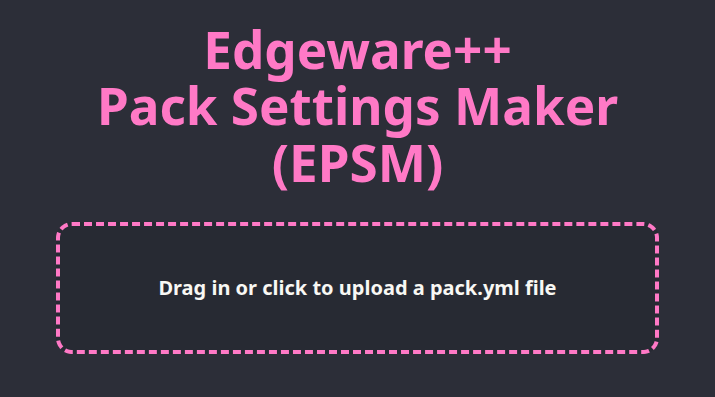
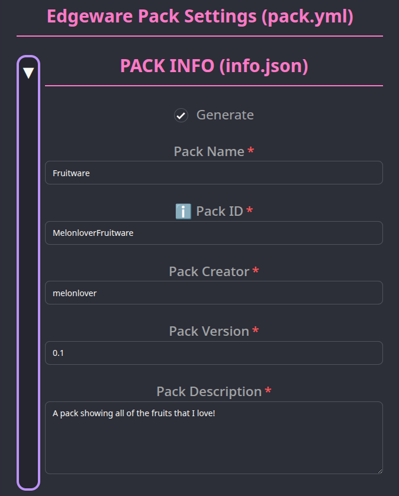
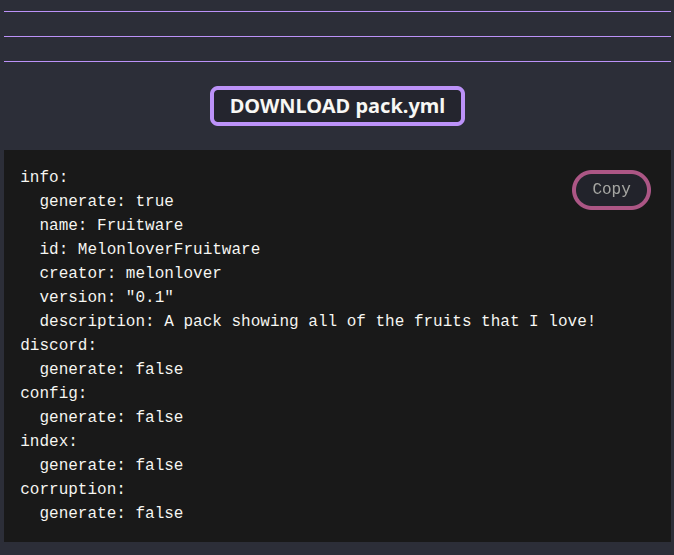
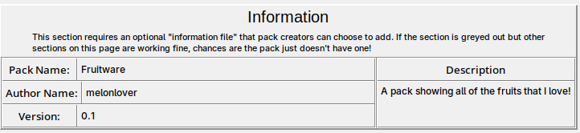

# Lesson 1: Your first pack

In this first lesson, we're going to build an Edgeware++ pack called **Fruitware**. We'll start simple and add more to the pack in each lesson. 

## Pack Setup

For our new **Fruitware** pack, we want to build a pack that shows off different fruits like peaches and eggplants.

To get started, create a new working pack folder using the [Pack Tool instructions for your platform (Windows/Linux)](https://github.com/araten10/EdgewarePlusPlus/blob/main/pack_tool/README.md).

### Creating a new working folder on Windows

1. Run `PackToolScript.bat`
2. Select `2. Create New Pack` (if you haven't set up the Pack Tool before choose `1. PackTool Setup` first!)
3. Give your working directory a name (we'll use `fruitware_working`)
4. Select `4. Exit` to close the Pack Tool

### Creating a new working folder on Linux

After running `setup.sh` once to setup the Pack Tool, run:
```
$ ./pack_tool.sh -n fruitware_working
```

### Working Folder Structure

The new working folder for your pack should have the following structure:

```
├── hypno
├── media
│   └── default
├── pack.yml
└── wallpapers
```

## Adding Content

Now that we have a working folder, find some pictures and/or videos and/or audio about fruits and put them into the `default` folder. I'm going to add the files `eggplant.jpg`, `peach.mp4` and `watermelon.mp3` to the folder. So, my pack's working folder will now look like this:

```
├── hypno
├── media
│   ├── default
│   │   ├── eggplant.jpg
│   │   ├── peach.mp4
│   │   └── watermelon.mp3
├── pack.yml
└── wallpapers
```

## Testing your pack

Now, let's test the pack inside Edgeware++. First, we need to use the Pack Tool to take the contents of our working folder and compile it into a test pack. 

### Building a Test Pack on Windows

1. Run `PackToolScript.bat`
2. Select `3. Finish Pack (compile and build)`
3. Enter the name of your pack's working directory (e.g `fruitware_working`)
4. The Pack Tool will ask if you want to quickbuild for testing. Select `2. Quickbuild Pack`
5. Select `4. Exit` to close the Pack Tool

### Building a Test Pack on Linux

Run:
```
$ ./pack_tool.sh -t fruitware_working
```


### Using Test Builds

After creating your test build, run the Edgeware++ config menu and go to "Switch Pack". You should now see a pack called `Pack tool test build`. Switch to this pack and then you can close the config window and then run Edgeware++ to test your pack in action.

**IMPORTANT**: Test builds don't make copies of your pack's original files like a normal build. Test builds point to the original files in your pack's working folder. This makes building test builds faster, but it also means that deleting files from the original folder will remove them from the test build too!

**IMPORTANT**: You can only have one test build at a time. If you make a test build for another pack, `Pack tool test build` will point to the files of the new pack's working folder.

## Adding info to your pack

Now that you've built your first pack, maybe you want to share it for other people to use. Before we do that, it's a good idea to generate a `info.json` to add some information to the pack. 

### Manually editing `pack.yml`

If you look in the original folder for your pack, you'll find the file `pack.yml`. If you open it, you'll find the following section at the top of the file:

```
info:
  # Generate info.json, true or false.
  generate: true

  # Name of your pack. (~20 char max)
  name: "Pack name"

  # Unique identified for your pack's mood file.
  id: "PackID"

  # Your name. (~20 char max)
  creator: "Your name"

  # Version of your pack.
  version: "1.0"

  # Short description of your pack. (~400 char max)
  description: >
    Pack description
```

This section of `pack.yml` is used to generate an info.json for your pack. You can open the file in your text editor of choice and manually make changes to the values of the `name`, `id`, `creator`, `version` and `description` fields.

Here is an example of these changes for our **Fruitware** pack:
```
info:
  # Generate info.json, true or false.
  generate: true

  # Name of your pack. (~20 char max)
  name: "Fruitware"

  # Unique identified for your pack's mood file.
  id: "MelonloverFruitware"

  # Your name. (~20 char max)
  creator: "melonlover"

  # Version of your pack.
  version: "0.1"

  # Short description of your pack. (~400 char max)
  description: >
    A pack showing all of the fruits that I love!
```


 Manually editing `pack.yml` is fine for small changes, but it's easy to make typos and other mistakes that result in an incorrect `pack.yml` that is difficult to debug. 

### Creating `pack.yml` with **EPSM**

An easier way to create/edit a `pack.yml` file is to use **Edgeware++ Pack Settings Maker (EPSM)**. With **EPSM**, you can create a new `pack.yml` or you can upload a valid `pack.yml` and edit it with **EPSM**.



For this tutorial, we'll load **EPSM** and use the starter template we're given. For now, we'll uncheck the "Generate?" buttons for everything except for the "PACK INFO" section. Here, we'll fill in our information: 



We'll now click the "Generate pack.yml" button.
This will generate the following output:



You can then download the generated `pack.yml` and replace the one in your pack's folder. Or you can click the "Copy" button to copy the text to your clipboard so you can manually replace the text in your pack's `pack.yml`.

**IMPORTANT**: **EPSM** runs fully in your computer's web browser. No data ever leaves your computer. **EPSM** can even be self-hosted if you need to.

### Viewing Pack Info

You should now have a `pack.yml` that's been edited with information about your pack. To see the changes, **we need to recompile the test pack**. So follow the same steps you followed to compile a test back before.

If you open the Edgeware++ config menu, you should now see info about your pack showing under the "Pack Info" tab:



## Packaging your pack 

Edgeware++ can only have one test build at a time, so eventually you want to turn your pack into a proper Edgeware pack that you can import it like you do with other packs. Once you're satisfied with your pack, you can use the Pack Tool to make a proper build of your pack. This will take longer than making a test pack as the Pack Tool needs to make copies of your original media files (and optionally compress them).


### Creating a Final Build on Windows

1. Run `PackToolScript.bat`
2. Select `3. Finish Pack (compile and build)`
3. Enter the name of your pack's working directory (e.g `fruitware_working`)
4. The Pack Tool will ask if you want to quickbuild for testing. Select `1: Build Pack Normally`
5. You will be asked if you want compress images and video. Choose your preferred option
6. You will be asked about mood-specific renaming. Choose your preferred option 
7. Select `4. Exit` to close the Pack Tool

### Creating a Final Build on Linux

Run:
```
$ ./pack_tool.sh fruitware_working
```

If you want to use compression, mood renaming or choose the output directory run the below command to see what flags are available:
```
$ ./pack_tool.sh -h
```

### Using the Final Build

Once your build is complete, you should have a new folder called `build` that you can rename (if you didn't already choose a different name for the build output).

You can copy this folder into the `edgeware/data/packs` path of your Edgeware++. Then you can open the Edgeware++ config menu and switch to your new pack to begin using it.

### Sharing your pack with others

If you want to share your pack with others, you need to compress the contents of your build folder into a .zip file

**IMPORTANT** Do not zip the `build` folder itself, zip everything INSIDE of the `build` folder.

After you've created the .zip file, you can share it with others and they can use it to import your pack into their Edgeware++ program with the "Import New Pack" button.

## Next Steps

In the [next tutorial](../lessons/02.md), we'll be using **EPSM** to build a custom `config.json` to give users the option to experience our pack using settings we've chosen.