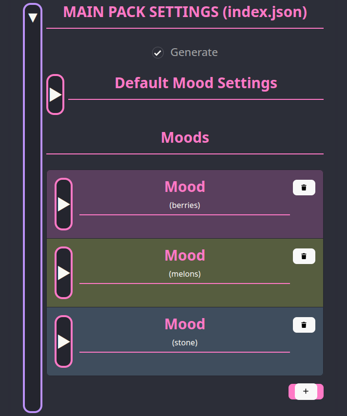
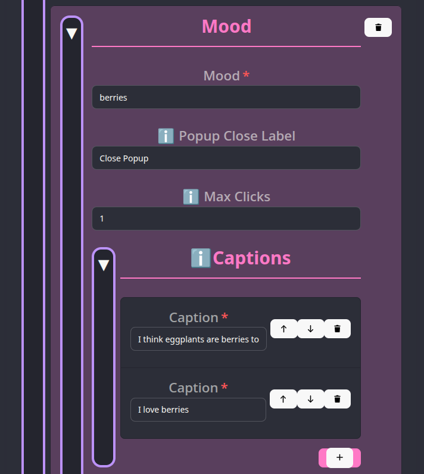
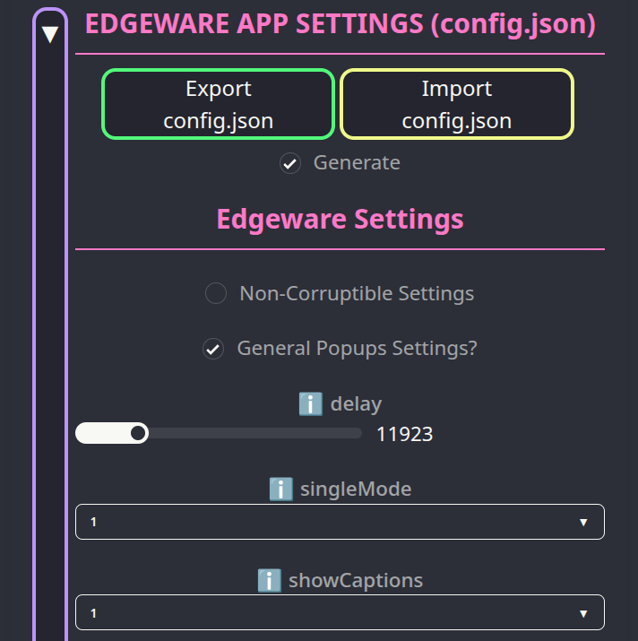
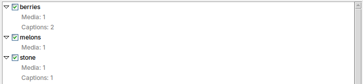

# Lesson 3: Moods and curating content

In this lesson, we continue building the **Fruitware** pack we started building in [Lesson 1](../lessons/01.md).

## Understanding Edgeware Moods and `index.json`

A pack's content can be grouped into different categories called **Moods**. Up until now, all our pack's content has been put into the mood called `default`, which every pack uses by...default. 

By grouping content into different moods, the user can use the Edgeware++ config menu to enable/disable content in our pack based on their personal preference. We can also use Corruption Mode to enable/disable moods depending on the current Corruption Level (we cover this in the [next lesson](../lessons/04.md)).

**IMPORTANT**: even when there are other moods present, the `default` mood is ALWAYS active and cannot be turned off by the user or Corruption Mode. The `default` Mood should only contain content you always want the user to experience. 

All of a mood's content is stored in the file `index.json`. This file stores the filenames of all the media files used in a pack and also all the text content used for features like Notification Popups and captions. Like all other JSON files that Edgeware++ packs use, we can generate `index.json` by using the **Pack Tool** and `pack.yml`:

### Sort text data into Moods

To sort our pack's text data (captions/notifications/prompts/web links/denial text) into different moods, we can put them under different moods in `pack.yml`

### Sort media files into Moods

To sort our pack's media files (images/video/audio) into different moods, we create different sub-folders for each mood under `media` in our pack's working folder. 

## Adding Moods and Captions to **Fruitware**

We want to add moods for different kinds of fruits in our **Fruitware** pack. So we'll create the following 3 *Moods*:
- `berries`
- `melons`
- `stone`

### Sorting media into moods folders

To put our existing media files into their correct moods, we will create new folders next to `default` in our pack's working folder and move our existing files into the correct moods. This is what the file structure will look like:

```
├── hypno
├── media
│   ├── berries
│   │   └── eggplant.jpg
│   ├── default
│   ├── melons
│   │   └── watermelon.mp3
│   └── stone
│       └── peach.mp4
├── pack.yml
└── wallpapers
```

Now, our `default` mood is empty of any media files.

### Adding text content to moods using **EPSM**

We want to display captions on our Image/Video Popups tailored the mood that a Popup belongs to. We'll upload our current `pack.yml` to **EPSM** and add all three of our new moods.



We'll then add some captions to the `berries` and `stone` moods as they have files that can create Image/Video Popups.



We also want to make sure the user has captions enabled in Edgeware++ so that they can see our captions. So, we'll add to our `config.json` settings in **EPSM** and set `showCaptions` to `1` (under `General Popup Settings?`) and this will be part of our pack's suggested settings in its generated `config.json`:



### Build the pack

After making your changes, update your `pack.yml` and rebuild the pack. Your built pack should now have an `index.json`.

If you open the Edgeware++ config menu, you should see your moods and their content listed under the Moods tab.



## Next Steps

In the [next tutorial](../lessons/04.md), we'll be using **EPSM** to configure Corruption Mode for our **Fruitware** pack. 