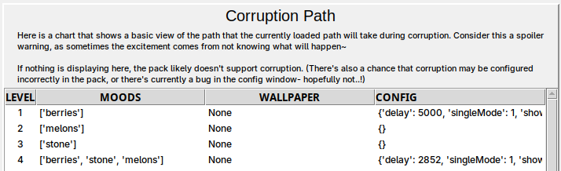
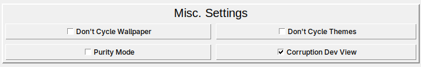

# Lesson 4: Dynamically changing Pack Settings with Corruption

In this lesson, we continue building the **Fruitware** pack we started building in [Lesson 1](../lessons/01.md).

## Understanding Corruption Mode and `corruption.json`

The **Corruption Mode** in Edgeware++ lets creators define Corruption Levels that can each have their own wallpapers and config settings.

For example, Level 1 can start with a `delay` value of `5000` milliseconds and further levels can reduce the value so that Popups appear more frequently as the levels increase. Corruption can also be used to enable/disable moods for different Levels.

Edgeware++ packs start at Level 1 and advance to further levels when certain conditions are met. Each Level will use the same settings as the previous level unless a setting is explicitly changed. Any config settings that don't get configured by Corruption will stay as whatever settings the user has preconfigured.

### Corruption Moods

When a pack is not using Corruption Mode, all moods are enabled (except for Moods that the user has disabled in the Edgeware++ config menu). But when Corruption is used, only the `default` Mood is enabled at the start. 

Corruption can only enable moods that the user hasn't disabled in the Edgeware++ config menu.

### Corruption Progression

The Corruption Level advances when certain conditions are met. These conditions are determined by the `corruptionTrigger` setting which can have the following values:
- `Timed`: the Level advances after a number of seconds have passed (determined by the `corruptionTime` setting)
- `Popup`: the Level advances after a number of Popups have appeared (determined by the `corruptionPopups` setting)
- `Launch`: the Level is set when you launch Edgeware++. The Level is set based on the number of times that the user has launched Edgeware++ (determined by the `corruptionLaunches` setting)
- `Script`: the Corruption Level is controlled by the `script.lua` file. [See the official Edgeware++ Scripting Documentation to learn more](https://github.com/araten10/EdgewarePlusPlus/blob/main/scripting.md)

**IMPORTANT**: While you can change the value of `corruptionTrigger` using Corruption, it currently doesn't have any effect. The `corruptionTrigger` value set when a pack is launched is the trigger type that will be used for the full session. If you prefer for your pack to use a specific trigger, you should set the `corruptionTrigger` value in your pack's `config.json`.

### Corruption Fade

Corruption transitions can happen in one of two ways depending on the value of the `corruptionFadeType` property. 
- `Normal`: The Levels can fade into each other. With this setting, content from moods in the next Level can sometimes appear in the current level. This becomes more likely the closer the session is to triggering the next Level.
- `Abrupt`: Corruption fully advances to the next Level as soon as the trigger requirements are met. Only moods from the current level will be used.

### Enabling Corruption

There is no way to automatically enable Corruption Mode through `config.json`. Your users have to enable Corruption through the Edgeware++ config menu.

## Adding Corruption to **Fruitware**

We want to add Corruption to our **Fruitware** pack. In the previous lesson we added the `berries`, `melons` and `stone` Moods to our pack. For our pack's Corruption Mode, we want each Level to focus on a different mood so that the user can fully appreciate each mood before we put all the Moods together for the final Level.

Each Corruption Level uses the same settings as the previous Level unless a setting gets changed in the new Level. So, we'll use Level 1 to configure the settings that we want to use for ALL the Levels. We'll then make smaller adjustments to the config as the levels progress.

### **Fruitware** Corruption Level Configs

We'll use **EPSM** to add Corruption settings to our existing `pack.yml`.

In **Level 1** we want to set the following:
- Set `delay` to `5000` milliseconds so that Popups show up every 5 seconds
- Set `popupMod` to `100` so that Image Popups are fully enabled
- Set `audioMod` to `100` so that Audio Popups are fully enabled
- Set `audioVolume` to `50` so that Audio Popups can be heard at half the max volume
- Set `vidMod` to `100` so that Video Popups are fully enabled
- Set `videoVolume` to `50` so that Video Popups can be heard at half the max volume
- Set `corruptionFadeType` to `Abrupt` so that Corruption Level transitions don't fade into each other

We'll leave the config settings the same for `Level 2` and `Level 3`.

For `Level 4`, we'll:
- Set `delay` to `3000` milliseconds so that Popups appear more frequently

### **Fruitware** Corruption Moods

We want to set our Corruption Moods as follows:

Level 1 Mood Settings (`berries` Mood active)
- Add the `berries` Mood

Level 2 Mood Settings (`melons` Mood active)
- Add the `melons` Mood
- Remove the `berries` Mood

Level 3 Mood Settings (`stone` Mood active)
- Add the `stone` Mood
- Remove the `melons` Mood

Level 4 Mood Settings (ALL Moods active)
- Add the `berries` Mood
- Add the `melons` Mood

### Build the pack

After making your changes, update your `pack.yml` and rebuild the pack. Your built pack should now have a `corruption.json`.

If you open the Edgeware++ config menu, you should see your Corruption setup under the Corruption tab:

While you're developing and testing your pack, it's helpful to be able to keep track of what level you're on and what moods are being used. You can do this by enabling Corruption Dev View in the Edgeware++ config menu so that your Image/Video Popups display this information while running your pack.

## Next Steps

Congratulations! You've finished the last tutorial of the **Fruitware** tutorial series. The [next lesson](../lessons/05.md) gives advice for where you might want to look next.